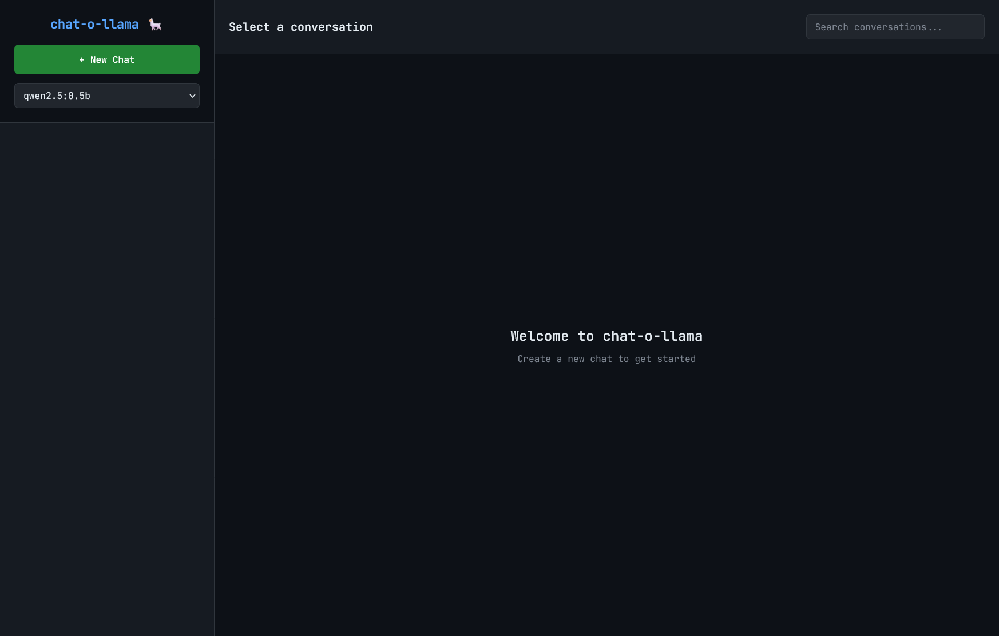
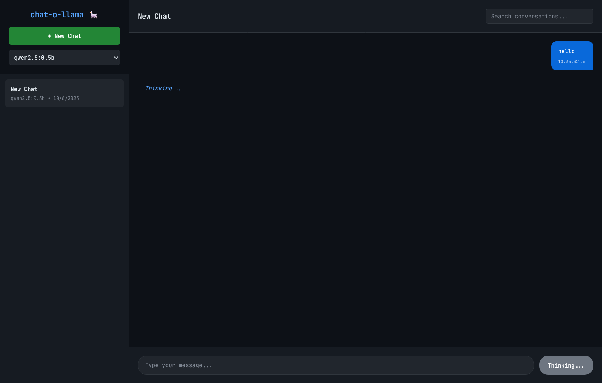
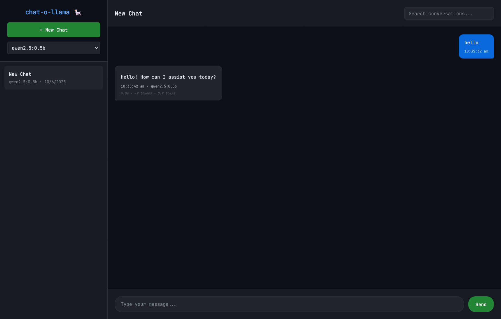
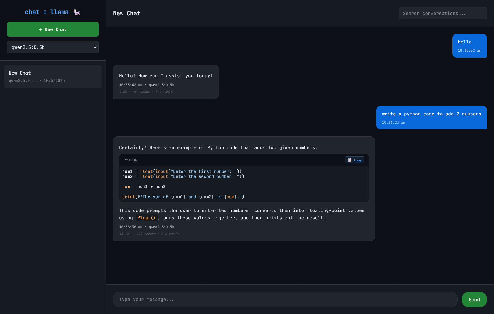
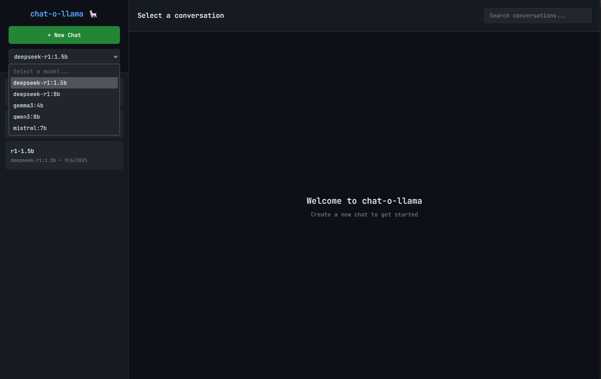

# chat-o-llama 🦙

**Your lightweight, private, local AI chatbot (no GPU needed**

A lightweight yet powerful web interface for Ollama with markdown rendering, syntax highlighting, and intelligent conversation management.

  

## ✨ Features

- 💬 **Multiple Conversations** - Create, manage, and rename chat sessions
- 📚 **Persistent History** - SQLite database storage with search functionality
- 🤖 **Model Selection** - Choose from downloaded Ollama models
- 🚀 **Lightweight** - Minimal resource usage for local development
- 📝 **Full Markdown rendering** - with GitHub-flavored syntax
- 📊 **Response metrics** - time, tokens, and speed tracking

## 🚀 30-Second Quick Start

**For most users (auto-install):**

```bash
curl -fsSL https://github.com/ukkit/chat-o-llama/raw/main/install.sh | bash
```

What happens?
- Installs Python/Ollama if missing (takes time)
- Downloads recommended model (~380MB)
- Installs chat-o-llama
Access at: ```http://localhost:3000```

<details> <summary><b>🔧 Advanced Setup (Manual Install)</b></summary>

For detailed manual installation steps, see **[install.md](./docs/install.md)**

```bash
git clone https://github.com/ukkit/chat-o-llama.git
cd chat-o-llama
python3 -m venv venv
source venv/bin/activate
pip install -r requirements.txt
./chat-manager.sh start
```

</details>

## 📸 Screenshots

<details> <summary><b> 📷 App Screenshots</b></summary>


First screen after installation


New chat screen with default model


Chat bubble, reply from the model


Support for Markdown in chat


Support to select from list of models


Thinking styling

</details>

## 🛠️ Need Help?

Quick Fixes:

- Port in use? → ./chat-manager.sh start 8080
- No models? → ollama pull tinyllama

## 📚 Documentation Links

| Document | Description |
|---------|-------------|
| [Installation Guide](./docks/install.md) | Installation Guide |
| [Features](./docks/features.md) | Detailed features guide |
| [Startup & Process Guide](./docks/chat_manager_docs.md) | Startup & Process Management via chat-manager.sh |
| [Config Guide](./docs/config.md) | Configuration Guide |
| [Config Comparison](./docs/config_comparison.md) | Compare different configs |
| [API Guide](./docs/api.md) | API Guide |
| [Troubleshooting Guide](./docs/troubleshooting.md) | Troubleshooting Guide |

## ✔️ Tested On (Hardware)

| Device | CPU | RAM | OS |
|---------|-------------|---------|-------------|
| Raspberry Pi 4 Model B Rev 1.4 | ARM Cortex-A72 | 8GB | Raspberry Pi OS |
| Dell Optiplex 3070 | i3-9100T | 8GB | Debian 12 |
| Nokia Purebook X14 | i5-10210U | 16 GB | Windows 11 Home |


## 🙏 Acknowledgments

- [Ollama](https://ollama.ai/) - Local AI platform
- [Flask](https://flask.palletsprojects.com/) - Web framework

**Made with ❤️ for the AI community**

> ⭐ Star this project if you find it helpful!

---

MIT License - see [LICENSE](LICENSE) file.